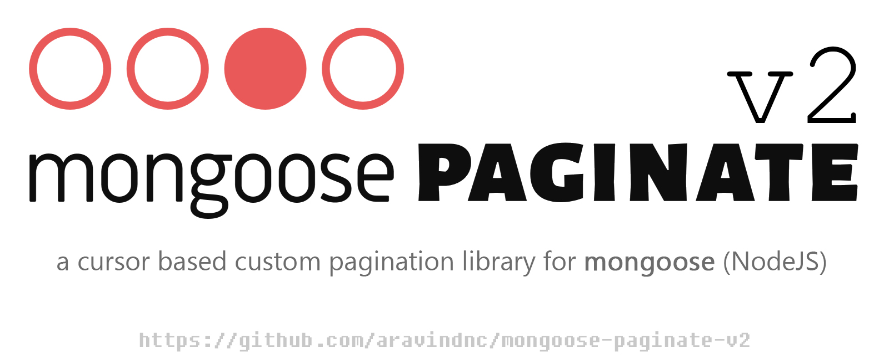

# mongoose-paginate-v2

[](https://www.npmjs.com/package/mongoose-paginate-v2)
[](#)
[](https://github.com/aravindnc/mongoose-paginate-v2/issues)
[](https://img.shields.io/npm/dm/mongoose-paginate-v2.svg)
[](https://app.fossa.com/projects/git%2Bgithub.com%2Faravindnc%2Fmongoose-paginate-v2?ref=badge_shield)


> A custom pagination library for [Mongoose](http://mongoosejs.com) with customizable labels.

If you are looking for aggregate query pagination, use this one [mongoose-aggregate-paginate-v2](https://github.com/aravindnc/mongoose-aggregate-paginate-v2)

[](https://www.npmjs.com/package/mongoose-paginate-v2)

## Why This Plugin

mongoose-paginate-v2 is a pagination library having a page wrapper. The main usage of the plugin is you can alter the return value keys directly in the query itself so that you don't need any extra code for transformation. The initial idea of this plugin is loosely based on mongoose-paginate package by github.com/edwardhotchkiss/. So this can be considered as an upgraded version of mongoose-paginate with much more options.

The below documentation is not perfect. Feel free to contribute. :)

## Installation

```sh
npm install mongoose-paginate-v2
```

## Usage

Add plugin to a schema and then use model `paginate` method:

```js
const mongoose = require('mongoose');
const mongoosePaginate = require('mongoose-paginate-v2');

const mySchema = new mongoose.Schema({
  /* your schema definition */
});

mySchema.plugin(mongoosePaginate);

const myModel = mongoose.model('SampleModel', mySchema);

myModel.paginate().then({}); // Usage
```

### Typescript

Prior to version `1.5.0`, types need to be installed from [DefinitelyTyped](https://github.com/DefinitelyTyped/DefinitelyTyped/tree/master/types/mongoose-paginate-v2).

To declare a `PaginateModel` in your Typescript files:

```ts
import mongoose from 'mongoose';
import paginate from 'mongoose-paginate-v2';

// declare your schema
export const institutionSchema = new mongoose.Schema({ name: String });

// paginate with this plugin
institutionSchema.plugin(paginate);

// declare a mongoose document based on a Typescript interface representing your schema
interface InstitutionDocument extends mongoose.Document, InstitutionData {}

// create the paginated model
const model = mongoose.model<
  InstitutionDocument,
  mongoose.PaginateModel<InstitutionDocument>
>('Institutions', institutionSchema, 'institutions');
```

### Model.paginate([query], [options], [callback])

Returns promise

**Parameters**

- `[query]` {Object} - Query criteria. [Documentation](https://docs.mongodb.org/manual/tutorial/query-documents)
- `[options]` {Object}

  - `[select]` {Object | String} - Fields to return (by default returns all fields). [Documentation](http://mongoosejs.com/docs/api.html#query_Query-select)
  - `[collation]` {Object} - Specify the collation [Documentation](https://docs.mongodb.com/manual/reference/collation/)
  - `[sort]` {Object | String} - Sort order. [Documentation](http://mongoosejs.com/docs/api.html#query_Query-sort)
  - `[populate]` {Array | Object | String} - Paths which should be populated with other documents. [Documentation](http://mongoosejs.com/docs/api.html#query_Query-populate)
  - `[projection]` {String | Object} - Get/set the query projection. [Documentation](https://mongoosejs.com/docs/api/query.html#query_Query-projection)
  - `[lean=false]` {Boolean} - Should return plain javascript objects instead of Mongoose documents? [Documentation](http://mongoosejs.com/docs/api.html#query_Query-lean)
  - `[leanWithId=true]` {Boolean} - If `lean` and `leanWithId` are `true`, adds `id` field with string representation of `_id` to every document
  - `[offset=0]` {Number} - Use `offset` or `page` to set skip position
  - `[page=1]` {Number}
  - `[limit=10]` {Number}
  - `[customLabels]` {Object} - Developers can provide custom labels for manipulating the response data.
  - `[pagination]` {Boolean} - If `pagination` is set to false, it will return all docs without adding limit condition. (Default: `True`)
  - `[useEstimatedCount]` {Boolean} - Enable [estimatedDocumentCount](https://docs.mongodb.com/manual/reference/method/db.collection.estimatedDocumentCount/) for larger datasets. Does not count based on given query, so the count will match entire collection size. (Default: `False`)
  - `[useCustomCountFn]` {Boolean} - Enable custom function for count datasets. (Default: `False`)
  - `[forceCountFn]` {Boolean} - Set this to true, if you need to support \$geo queries. (Default: `False`)
  - `[customFind]` {String} - Method name for the find method which called from Model object. This options can be used to change default behaviour for pagination in case of different use cases (like [mongoose-soft-delete](https://github.com/dsanel/mongoose-delete#method-overridden)). (Default `'find'`)
  - `[allowDiskUse]` {Boolean} - Set this to true, which allows the MongoDB server to use more than 100 MB for query. This option can let you work around QueryExceededMemoryLimitNoDiskUseAllowed errors from the MongoDB server. (Default: `False`)
  - `[read]` {Object} - Determines the MongoDB nodes from which to read. Below are the available options.
    - `[pref]`: One of the listed preference options or aliases.
    - `[tags]`: Optional tags for this query. (Must be used with `[pref]`)
  - `[options]` {Object} - Options passed to Mongoose's `find()` function. [Documentation](https://mongoosejs.com/docs/api.html#query_Query-setOptions)

- `[callback(err, result)]` - If specified, the callback is called once pagination results are retrieved or when an error has occurred

**Return value**

Promise fulfilled with object having properties:

- `docs` {Array} - Array of documents
- `totalDocs` {Number} - Total number of documents in collection that match a query
- `limit` {Number} - Limit that was used
- `hasPrevPage` {Bool} - Availability of prev page.
- `hasNextPage` {Bool} - Availability of next page.
- `page` {Number} - Current page number
- `totalPages` {Number} - Total number of pages.
- `offset` {Number} - Only if specified or default `page`/`offset` values were used
- `prevPage` {Number} - Previous page number if available or NULL
- `nextPage` {Number} - Next page number if available or NULL
- `pagingCounter` {Number} - The starting index/serial/chronological number of first document in current page. (Eg: if page=2 and limit=10, then pagingCounter will be 11)
- `meta` {Object} - Object of pagination meta data (Default false).

Please note that the above properties can be renamed by setting customLabels attribute.

### Sample Usage

#### Return first 10 documents from 100

```javascript
const options = {
  page: 1,
  limit: 10,
  collation: {
    locale: 'en',
  },
};

Model.paginate({}, options, function (err, result) {
  // result.docs
  // result.totalDocs = 100
  // result.limit = 10
  // result.page = 1
  // result.totalPages = 10
  // result.hasNextPage = true
  // result.nextPage = 2
  // result.hasPrevPage = false
  // result.prevPage = null
  // result.pagingCounter = 1
});
```

### With custom return labels

Now developers can specify the return field names if they want. Below are the list of attributes whose name can be changed.

- totalDocs
- docs
- limit
- page
- nextPage
- prevPage
- hasNextPage
- hasPrevPage
- totalPages
- pagingCounter
- meta

You should pass the names of the properties you wish to changes using `customLabels` object in options.
Set the property to false to remove it from the result.
Same query with custom labels

```javascript
const myCustomLabels = {
  totalDocs: 'itemCount',
  docs: 'itemsList',
  limit: 'perPage',
  page: 'currentPage',
  nextPage: 'next',
  prevPage: 'prev',
  totalPages: 'pageCount',
  pagingCounter: 'slNo',
  meta: 'paginator',
};

const options = {
  page: 1,
  limit: 10,
  customLabels: myCustomLabels,
};

Model.paginate({}, options, function (err, result) {
  // result.itemsList [here docs become itemsList]
  // result.paginator.itemCount = 100 [here totalDocs becomes itemCount]
  // result.paginator.perPage = 10 [here limit becomes perPage]
  // result.paginator.currentPage = 1 [here page becomes currentPage]
  // result.paginator.pageCount = 10 [here totalPages becomes pageCount]
  // result.paginator.next = 2 [here nextPage becomes next]
  // result.paginator.prev = null [here prevPage becomes prev]
  // result.paginator.slNo = 1 [here pagingCounter becomes slNo]
  // result.paginator.hasNextPage = true
  // result.paginator.hasPrevPage = false
});
```

### Use helper-class for passing query object into Model.paginate()

For conveniently passing on all request query parameters into paginate(), without having to specify them all in the controller, you can use the PaginationParameters-class. The example below is with express.js code, but can be applied to any request, where the query string has been parsed into an object.

```javascript
const { PaginationParameters } = require('mongoose-paginate-v2');

// req.query = {
//   page: 1,
//   limit: 10,
//   query: {"color": "blue", "published": true}
//   projection: {"color": 1}
// }

req.get('/route', (req, res) => {
  Model.paginate(...new PaginationParameters(req).get()).then((result) => {
    // process the paginated result.
  });

  console.log(new PaginationParameters(req).get()); // [{ color: "blue", published: true }, { page: 1, limit: 10, projection: { color: 1 } }]
});
```

**Note**: `req.query.projection` and `req.query.query` have to be valid JSON. The same goes for any option which is passed into Model.paginate() as an array or object.

### Other Examples

Using `offset` and `limit`:

```javascript
Model.paginate({}, { offset: 30, limit: 10 }, function (err, result) {
  // result.docs
  // result.totalPages
  // result.limit - 10
  // result.offset - 30
});
```

With promise:

```js
Model.paginate({}, { offset: 30, limit: 10 }).then(function (result) {
  // ...
});
```

#### More advanced example

```javascript
var query = {};
var options = {
  select: 'title date author',
  sort: { date: -1 },
  populate: 'author',
  lean: true,
  offset: 20,
  limit: 10,
};

Book.paginate(query, options).then(function (result) {
  // ...
});
```

#### Zero limit

You can use `limit=0` to get only metadata:

```javascript
Model.paginate({}, { limit: 0 }).then(function (result) {
  // result.docs - empty array
  // result.totalDocs
  // result.limit - 0
});
```

#### Set custom default options for all queries

config.js:

```javascript
var mongoosePaginate = require('mongoose-paginate-v2');

mongoosePaginate.paginate.options = {
  lean: true,
  limit: 20,
};
```

controller.js:

```javascript
Model.paginate().then(function (result) {
  // result.docs - array of plain javascript objects
  // result.limit - 20
});
```

#### Fetch all docs without pagination

If you need to fetch all the documents in the collection without applying a limit. Then set `pagination` as false,

```javascript
const options = {
  pagination: false,
};

Model.paginate({}, options, function (err, result) {
  // result.docs
  // result.totalDocs = 100
  // result.limit = 100
  // result.page = 1
  // result.totalPages = 1
  // result.hasNextPage = false
  // result.nextPage = null
  // result.hasPrevPage = false
  // result.prevPage = null
  // result.pagingCounter = 1
});
```

#### Using custom count function

If you need to use your own custom count function, then set `useCustomCountFn` as your custom count function. Make sure the function is returning count as a **promise**.

```javascript
const options = {
  useCustomCountFn: function () {
    return Promise.resolve(100);
  },
};

Model.paginate({}, options, function (err, result) {
  // result.docs
});
```

#### Setting read preference

Determines the MongoDB nodes from which to read.

```js
const options = {
  lean: true,
  limit: 10,
  page: 1,
  read: {
    pref: 'secondary',
    tags: [
      {
        region: 'South',
      },
    ],
  },
};

Model.paginate({}, options, function (err, result) {
  // Result
});
```

### Pagination for Sub-Documents

If you want to paginate your sub-documents, here is the method you can use.

```js
var query = { name: 'John' };
var option = {
  select: 'name follower',
  pagingOptions: {
    // your populate option
    populate: {
      path: 'follower',
    },
    page: 2,
    limit: 10,
  },
};

// Only one document (which object key with name John) will be return
const result = await Book.paginateSubDocs(query, option);
```

#### AllowDiskUse for large datasets

Sets the allowDiskUse option, which allows the MongoDB server to use more than 100 MB for query. This option can let you work around `QueryExceededMemoryLimitNoDiskUseAllowed` errors from the MongoDB server.

**Note that this option requires MongoDB server >= 4.4. Setting this option is a no-op for MongoDB 4.2 and earlier.**

```js
const options = {
  limit: 10,
  page: 1,
  allowDiskUse: true,
};

Model.paginate({}, options, function (err, result) {
  // Result
});
```

Below are some references to understand more about preferences,

- <https://github.com/Automattic/mongoose/blob/master/lib/query.js#L1008>
- <https://docs.mongodb.com/manual/core/read-preference/>
- <http://mongodb.github.io/node-mongodb-native/driver-articles/anintroductionto1_1and2_2.html#read-preferences>

## Known Issues

### For Mongoose < 6.0.0

There are few operators that this plugin does not support natively, below are the list and suggested replacements.

- $where: $expr
- $near: $geoWithin with \$center
- $nearSphere: $geoWithin with \$centerSphere

But we have added another option. So if you need to use $near and $nearSphere please set `forceCountFn` as true and try running the query.

```js
const options = {
  lean: true,
  limit: 10,
  page: 1,
  forceCountFn: true,
};

Model.paginate({}, options, function (err, result) {
  // Result
});
```

### For Mongoose > 6.0.0

$geoNear, $near, and $nearSphere may not work (Untested). This will be updated in the future plugin versions.

## Development

- Ensure all tests pass before you commit by running `npm run test`. In order to run the tests, you need to have the Mongo Deamon running locally.
- There are pre-commit hooks that run to ensure the _files you've changed_ are formatted correctly.
- Optionally you can manually run `npm run lint && npm run prettier` to lint and format every relevant file
- If using VS Code, install eslint and prettier for easy editor integration.

## Changelog

[View Changelog](CHANGELOG.md)

## License

[MIT](LICENSE)
